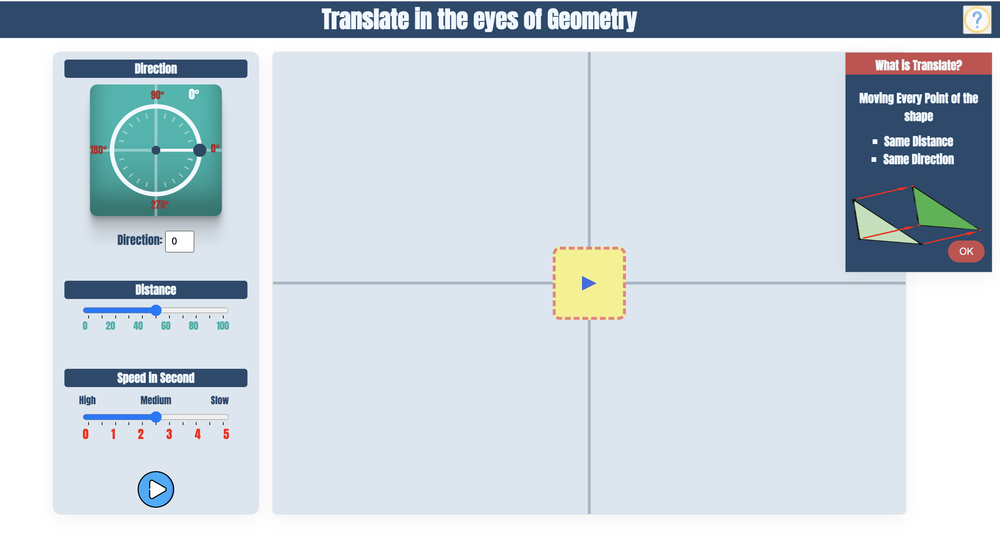

# Artamic Conceptual Functionality(Translate)
A Prototype of the functional behavior of how to Translate an object in a geometrical view.
 
used tools:
- Javascript
- CSS
- HTML

  <a href="https://sukhan220.github.io/ArtamicConceptualFunctionality-/">Demo<a>

video:

https://user-images.githubusercontent.com/17803144/201810972-c2b9ba24-1661-445c-99ad-3706cb239588.mp4

###### Translate of geomatrical view without definition. It's An interface that will move the object according to the user's input.

  

###### Translate of geomatrical view with definition.

  

